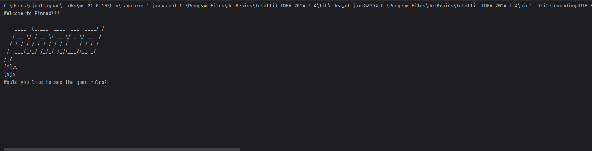
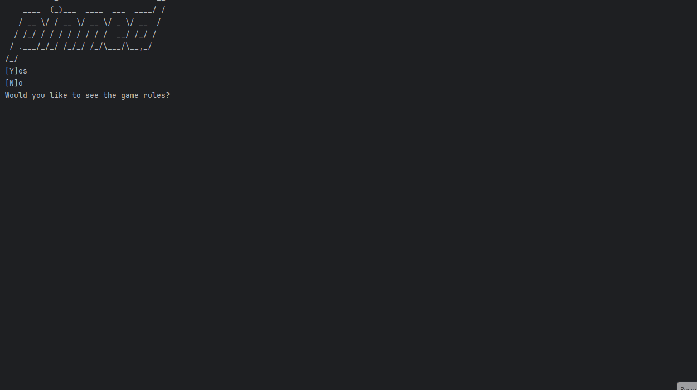
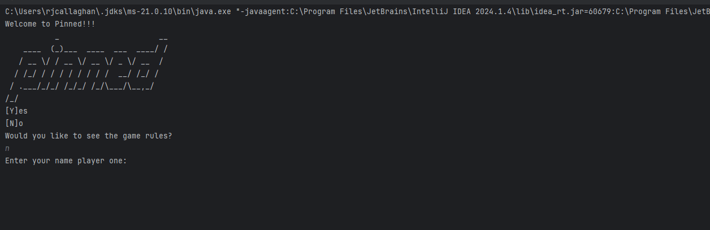
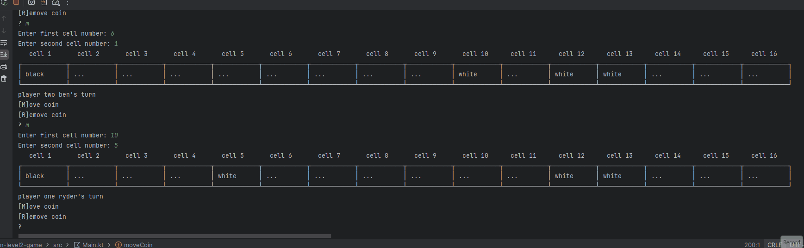
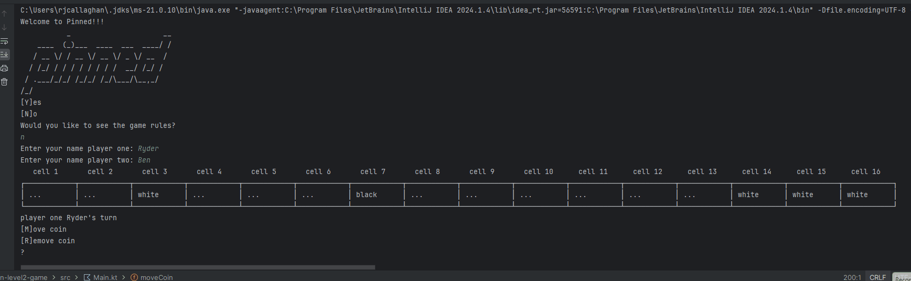
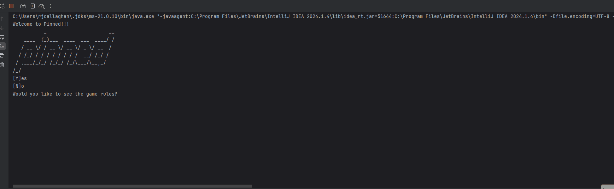
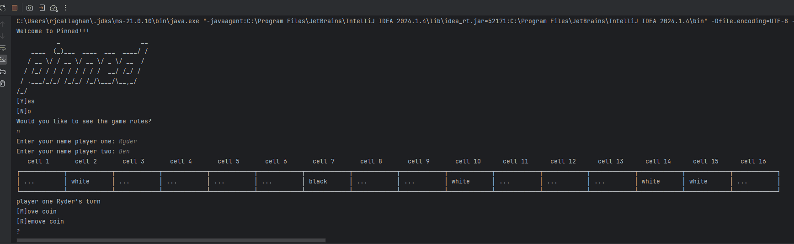

# Results of Testing

The test results show the actual outcome of the testing, following the [Test Plan](test-plan.md)

---

## boundary test

testing that the program can move or remove values that are at the boundary of the valid range.

### Test Data Used

I used the move function to move one coin .

### Test Result

Valid The test was successful and the game worked.

---

## The player can read the instructions for the game.

The player can ask for the game instructions so that they can understand how to play the game.

### Test Data Used

I will try to enter y in order to agree to receiving the instructions.

### Test Result

Valid. The test was successful and I was able to receive and read the instructions.

---

## Player can input names.

I will test that the player is capible of entering their name into the program.

### Test Data used

I will try entering two seperate names into the program "Ben" and "Ryder".

### Test Result

Valid. I was able to input both names into the program.

---

## Player is able to win.

The player is able to win and beat the other player.

### Test Data used

I will remove the black coin from the grid as one of the players in order to win the game.

### Test Result

valid. The test was successful and the player is able to win.

---

## Player can move coins

Testing that the player can move the black and white coins to progress the game.

### Test Data To Use

I input m to move and used numbers to decide what coin I wanted to go where on the grid.

### Test Result

valid. The test was successful and I was able to move the coins around the grid.

---

## board can be set up

Testing if the program can set up the board to play the game on.

### Test Data To Use

I will start the game to see if it can set up the board.

### Test Result

Valid. The test was successful and the program was able to set up the game board.

---

## The players take turns

This test makes sure that players can take turns.

### Test Data To Use

I will use my turn as player one and see if the program switches to player two afterwards.

### Test Result

Valid. The test was successful and the program was able to switch from player one to player two after player one had taken his turn.

---

